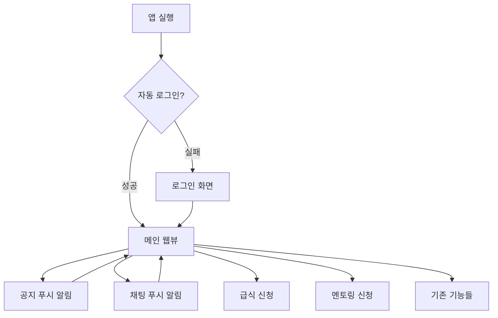
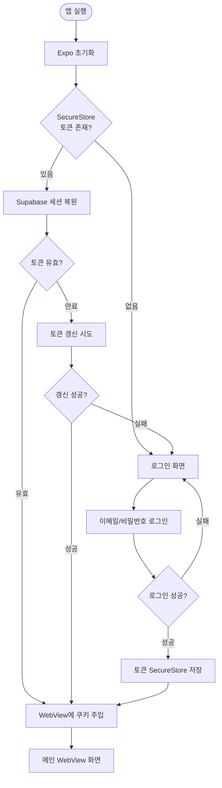
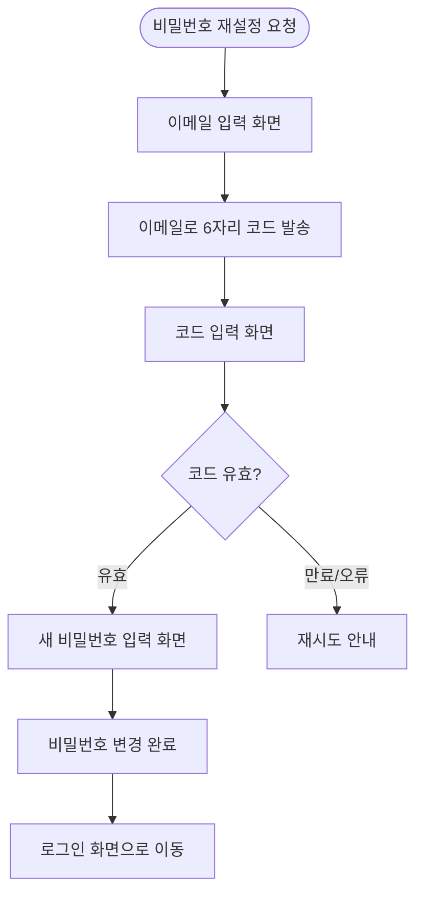
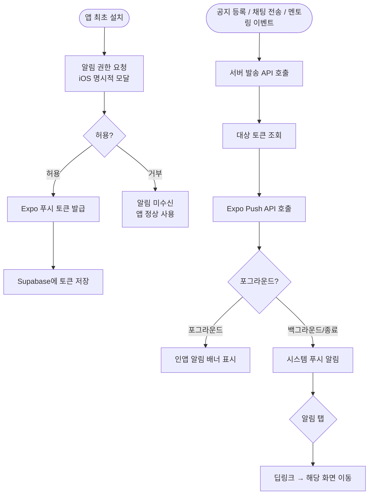
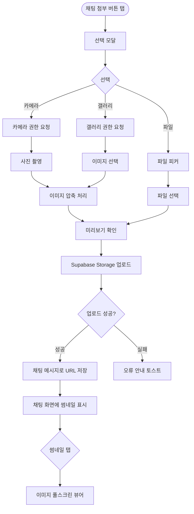
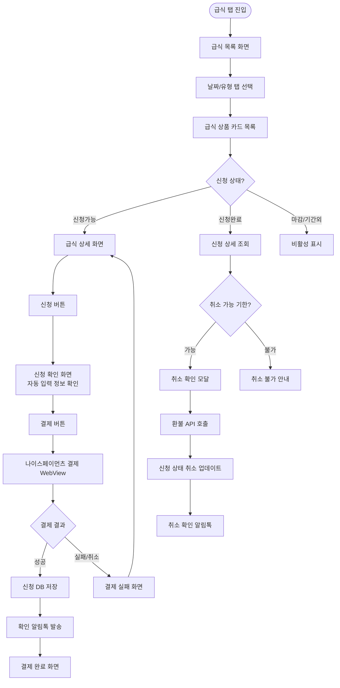
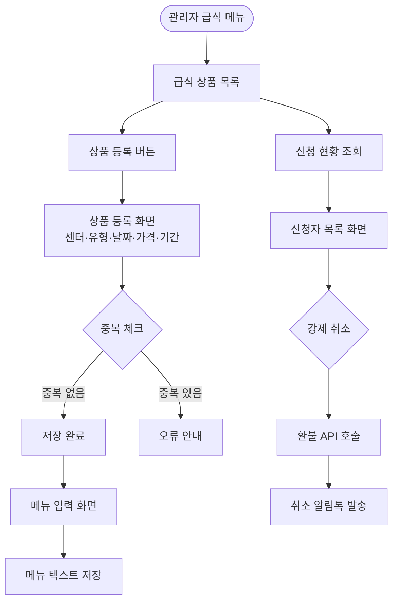
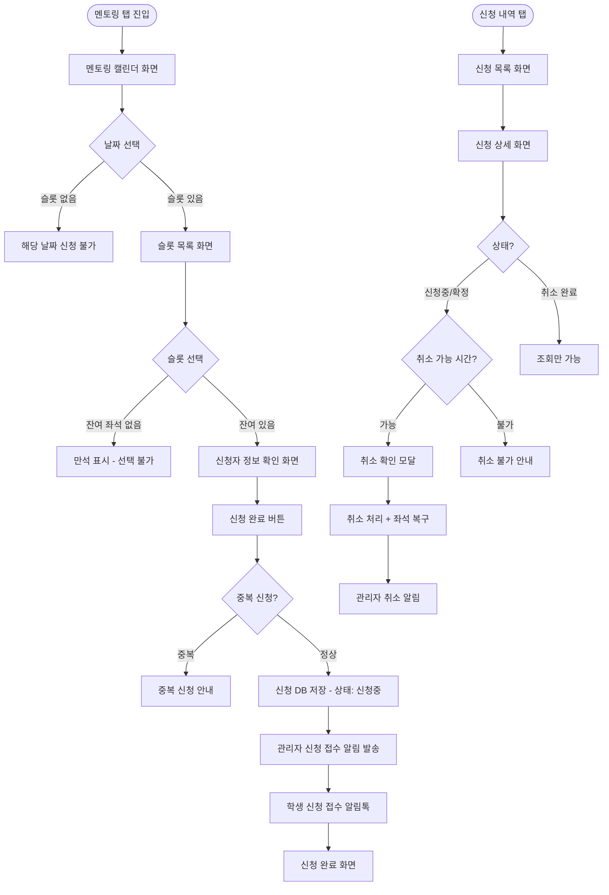
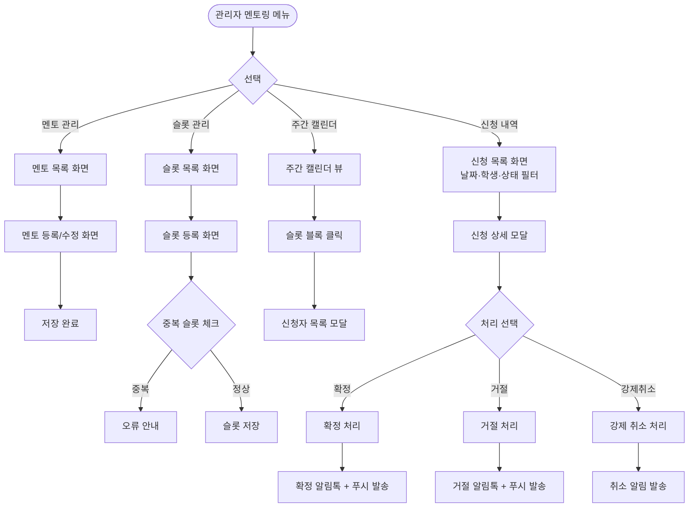
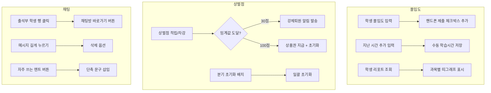

# Step 4: 유저 플로우 — 웨버스터디앱 통합 플랜

---

## 전체 시스템 구조

---

## 1. 앱 쉘 / 자동 로그인 플로우

---

## 2. 비밀번호 재설정 플로우

---

## 3. 푸시 알림 시스템 플로우

---

## 4. 파일·사진 첨부 플로우

---

## 5. 급식 신청·결제 플로우

---

## 6. 급식 관리 플로우 (관리자)

---

## 7. 멘토링 신청 플로우 (학생·학부모)

---

## 8. 멘토링 스케줄 관리 플로우 (관리자)

---

## 9. 기존 기능 개선 플로우

---

## 노드 집계 요약

| 시스템 | 리프 노드 수 |
|--------|------------|
| 1. 앱 쉘 (Expo 설정, WebView, 배포) | 8개 |
| 2. 푸시 알림 (인프라, 공지, 채팅, 멘토링) | 10개 |
| 3. 자동 로그인 + 비밀번호 재설정 | 8개 |
| 4. 파일·사진 첨부 (채팅, 공지) | 9개 |
| 5. 급식 신청 (목록, 결제, 취소, 내역) | 10개 |
| 6. 급식 관리 (관리자) | 6개 |
| 7. 멘토링 신청 (학생·학부모) | 9개 |
| 8. 멘토링 스케줄 관리 (관리자) | 12개 |
| 9. 기존 웹 기능 개선 | 10개 |
| **합계** | **82개** |
