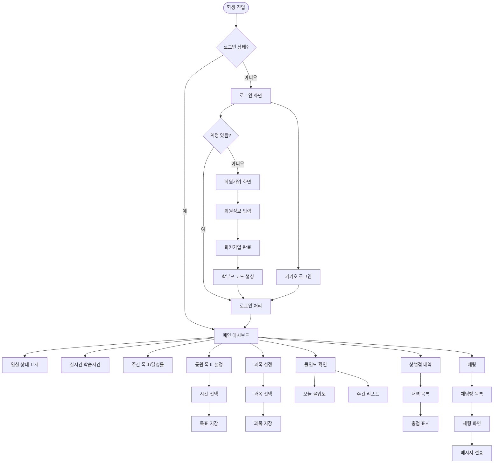
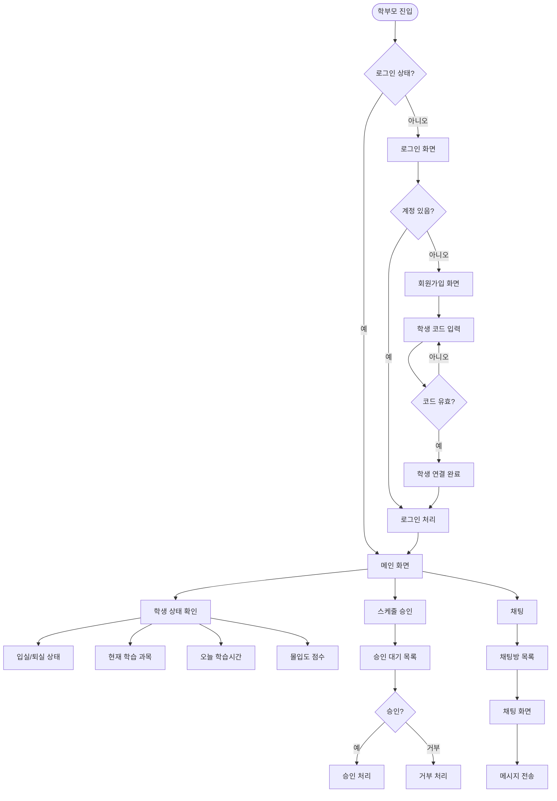
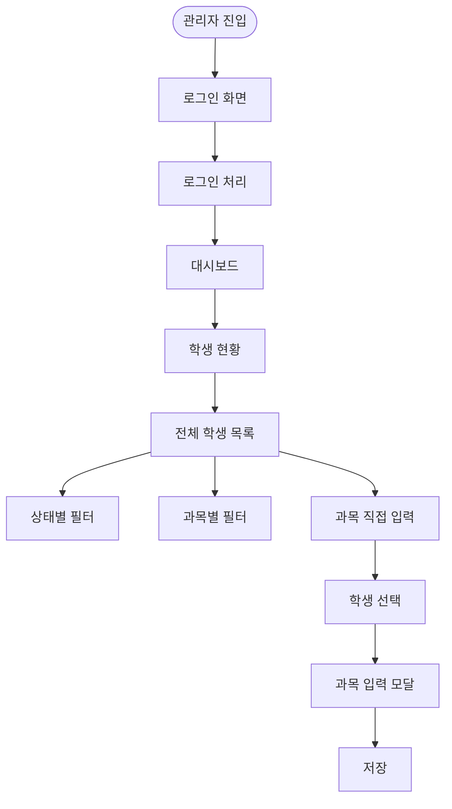
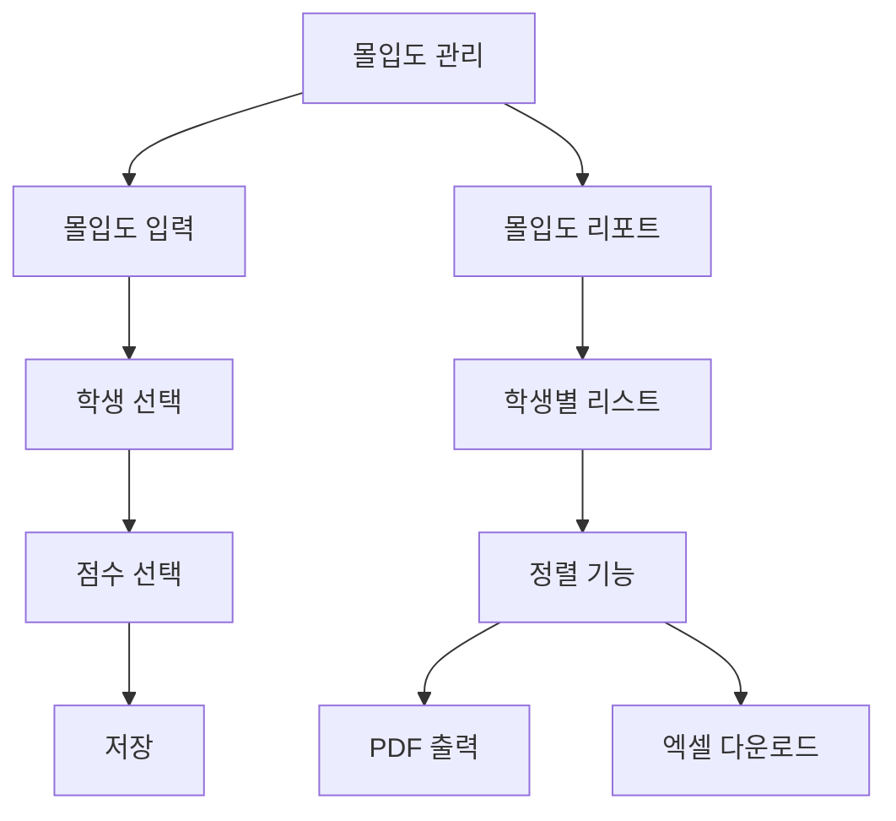
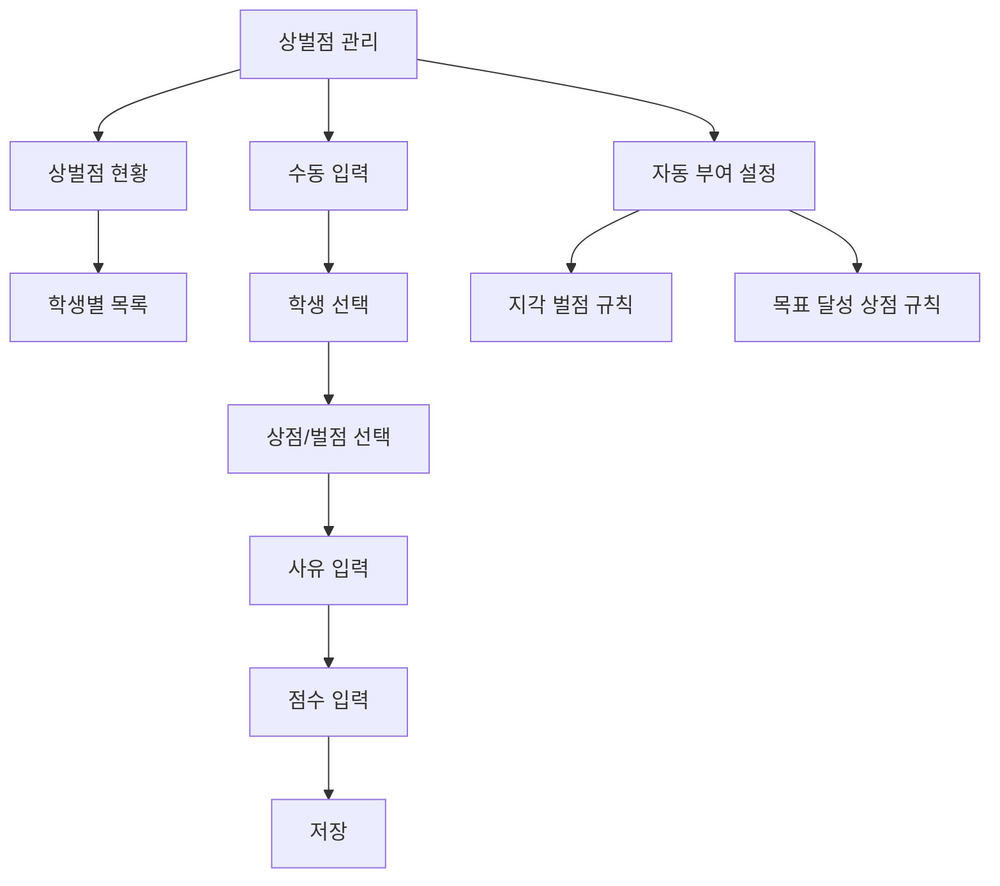
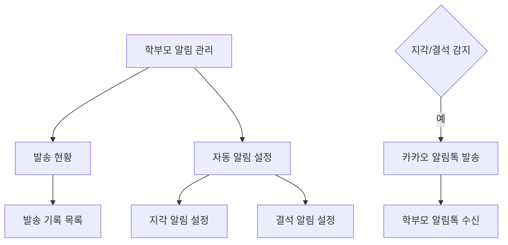
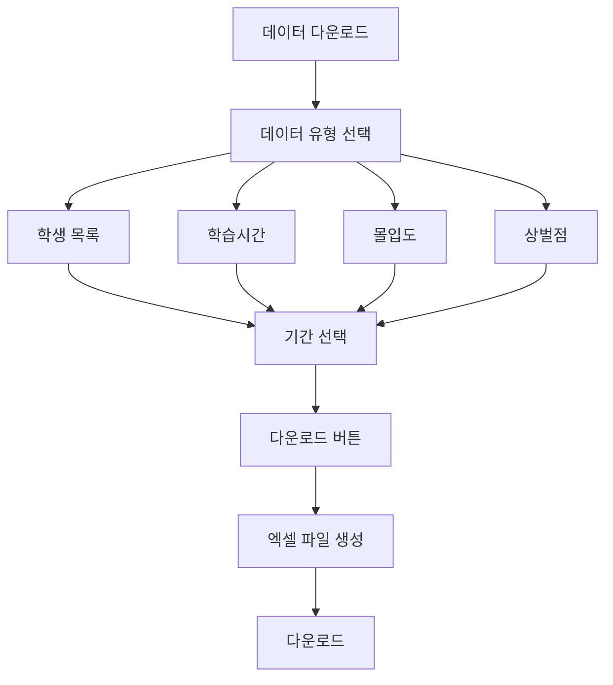
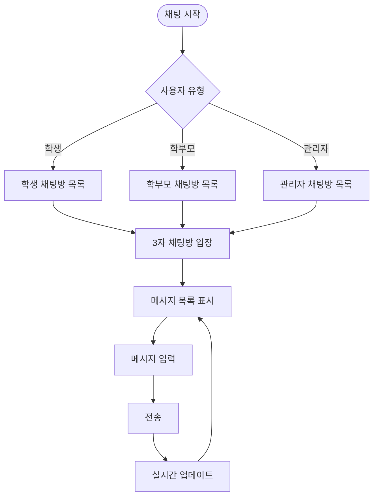
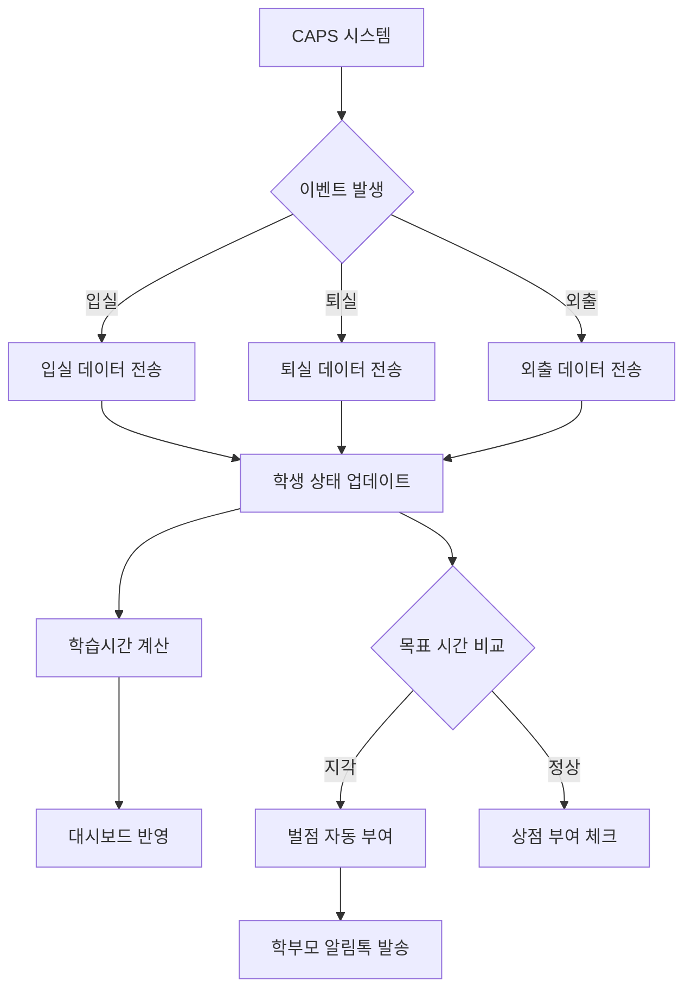

# 유저 플로우

## 전체 시스템 구조

```mermaid
graph TD
    Start([시작])
    
    Start --> Student[학생 웹]
    Start --> Parent[학부모 웹]
    Start --> Admin[관리자 웹사이트]
    
    Student --> S_Auth[회원가입/로그인]
    Student --> S_Dashboard[메인 대시보드]
    Student --> S_Goal[등원 목표 설정]
    Student --> S_Subject[과목 설정]
    Student --> S_Focus[몰입도 확인]
    Student --> S_Point[상벌점 내역]
    Student --> S_Chat[3자 채팅]
    
    Parent --> P_Auth[회원가입/로그인]
    Parent --> P_Status[학생 상태 확인]
    Parent --> P_Approve[스케줄 승인]
    Parent --> P_Chat[3자 채팅]
    
    Admin --> A_Auth[로그인]
    Admin --> A_Dashboard[학생 현황]
    Admin --> A_Focus[몰입도 관리]
    Admin --> A_Point[상벌점 관리]
    Admin --> A_Push[알림 관리]
    Admin --> A_User[회원 관리]
    Admin --> A_Data[데이터 다운로드]
    Admin --> A_Chat[채팅 관리]
```

## 학생 웹 상세 플로우

## 학부모 웹 상세 플로우

## 관리자 웹사이트 상세 플로우

## 관리자 - 몰입도 관리 플로우

## 관리자 - 상벌점 관리 플로우

## 관리자 - 학부모 알림톡 플로우

## 관리자 - 데이터 다운로드 플로우

## 3자 채팅 플로우

## CAPS 연동 플로우

